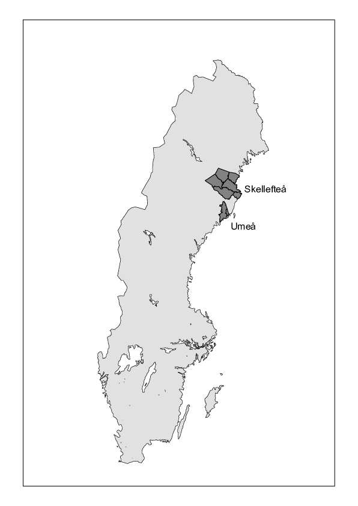

```{r setup, include=FALSE}
knitr::opts_chunk$set(echo = FALSE, cache=FALSE,messages=FALSE,comment=NA)
```


# Introduction

This research question is not new.
@kom97 discussed contemporary explanation models of the fertility
transition and argued that there cannot be one explanation alone.
More recent studies of Swedish circumstances were given by @drsc14
and @tbdr14. One perhaps convincing theory is that the fertility
decline was a necessary result of the mortality decline. For a detailed and
initiated overview of the research field, see the aforementioned papers and
also two thoughtful papers by Ní Bhrolcháin [@ni92; @ni11].  

# The study area

Our data cover the time period 1821--1950, see Figure \@ref(fig:lexis), and
the geographical area defined by the Skellefteå and Umeå towns with
surrounding rural parishes. 
Where in Sweden? See map in Figure \@ref(fig:map2).

```{r map2, fig.cap = "The Skellefteå and Umeå regions in Sweden.",out.height="3in"}

##knitr::include_graphics("myfigs/SKEUME161017.pdf", dpi=70)
```
The Skellefteå region was one big parish in the eighteenth century. It
successively split up in smaller parishes.

<!--
, and Figure \@ref(fig:map) shows
the status in the year 1915. In our data, *Fällfors* is part of
*Byske*, and *Lövånger* and *Burträsk* are not present at
all. 
-->
The development of population size in the two regions is shown in
Figure \@ref(fig:plotpopsize). 

```{r popsize,cache=TRUE}
library(skum)
xs <- 1801:1950
skel <- numeric(150)
xu <- 1901:1950
ume <- numeric(50)
for (i in 1:150){
    skel[i] <- with(obs[obs$region == "ske", ], sum(birthdate + enter < 1800 + i & birthdate + exit >= 1800 + i))
}
for (i in 1:50){
    ume[i] <- with(obs[obs$region == "ume", ], sum(birthdate + enter < 1900 + i & birthdate + exit >= 1900 + i))
}
```


```{r plotpopsize, fig.height = 5, fig.cap = "Population size by year and region.", cache = TRUE}
plot(xs, skel / 1000, type = "l", col = "red", ylim = c(0, 70), ylab = "Population / 1000", 
     xlab = "Year", las = 1)
axis(4, las = 1)
lines(xu, ume /1000, type = "l", col = "blue")
text(1870, 40, "Skellefteå", col = "red")
text(1925, 15, "Umeå", col = "blue")
abline(h = 0)
```

## Skellefteå

At the outset of the study the region consisted of one large rural parish,
Skellefteå. By 1900 three new parishes had been detached into separate
units, but their populations are still included in the study.  The region
was large, both in terms of 
area and of population. With an area of about 1700 square miles,
Skellefteå was considerably larger than most rural parishes in Sweden. It
was considered a one-day journey to travel from the northern to the
southern border, and a ride from the coast to the more remote and sparsely
populated parts of the parish in the west could take even longer,
especially in wintertime. The main part of the population was, however,
concentrated in the coastal area and in river valleys.  In the early 19th
century the population size was around 6900, and it increased rapidly during the
first half of the century. By 1850 it had reached to about 17000 and at the
turn of the century it had further doubled. Despite the large increase in
population, which was mainly the result of a high natural growth, the
population density on the whole remained low [@as94].

Skellefteå was during the studied period a rural area with a mixed economy,
based on animal husbandry, forestry and sidelines such as tar and saltpeter
production. By the mid-19th century export of tar and lumber became an
increasingly important part of the economy. The majority of the farmers in
the region were smallholders and there were no large estates. Some small
sawmills were established early in the century, but before 1900,
industrialization had little impact on the local economy. In 1835,
approximately 85 percent of the population made their living from
farming. Although the distribution of economic resources was more uniform
than in several other Swedish regions, the social stratification became
more pronounced throughout the 19th century. The increasing
proletarianization was mainly a consequence of rapid population growth. The
number of farming households remained fairly stable, while the number of
landless households increased. The socio-economic development was also
influenced by two devastating subsistence crises in the region, in the
1830s and in the 1860s [@eng05].  

Infant mortality was comparatively low. Fertility was high, not only by Swedish
standards, but also in European comparison and there are no
indications of family planning. Total fertility fluctuated around five
children per woman and, although fertility did decline during the
nineteenth century, the actual fertility transition occurred late in the
district [@as94; @coa86]. The rate of illegitimacy was low in comparison
with many other parts of Northern Sweden, where frequent pre-nuptial
conceptions and illegitimate births were common. The illegitimacy rate
fluctuated between three and six per cent during the nineteenth century
\citep{as94}.  

## Umeå

The Umeå region is one of the newest in the collection of regions digitized
at the Demographic Data Base, Umeå University. The covered time period is
shorter than the one for the Skellefteå region in that registration starts
around January 1, 1901.

Umeå is older and substantially larger than Skellefteå as a town: The birth
year of the town Umeå is 
generally recognized as 1622. 
Umeå became early a center for administration and education, but Umeå
University is not a fact before 1963.  
Early in the twentieth century, two military regiments were placed in Umeå,
and they remained there during the first half of the century. 
The population size as defined in our data sets was 19000 on January 1,
1900, 33000 on 
January 1, 1950 and 104000 when the end of the century.

The surrounding rural area is similar in demography and economy to the
corresponding parts of the Skellefteå region.  

# Models

The statistical modeling is conveniently done in the framework of
counting (birth) processes, but there are still choices to contemplate:
Choice of time scale, and how to handle the dynamic aspects of the counting
process. In most of the earlier attempts to investigate changes in
*stopping* and *spacing* behavior over time, models for
*birth intervals* have been employed
\citep{bedr06,drsc14,tbdr14,bras14}, but in my opinion this approach is too
indirect. Instead I argue for the *counting process* approach, where
each married woman contributes an age interval (or a union of such
intervals), starting at age of marriage or age 20, whichever comes
*last*, and ends with the dissolution of marriage or age 50, whichever
comes *first*. We also allow intervals to start and end with migration
events. In the so defined interval, birth time (age) points are recorded.  

```{r getdata, cache = TRUE}
##load("data/kids2.rda")  # NOTE the shift to 'kids2' !!!!!!! 
##kids <- kids2
## 'Cleaned': 'kids' is the one to use:

load("data/kids.rda")

kids.orig <- kids ## Nice to have later!

library(skum)
##library(eha)
## Factor hisclass into six groups:
kids$hisclass <- cut(kids$hisclass, c(0, 1.5, 2.5, 3.5, 4.5, 5.5, 7.5), 
                     labels = c("elite", "middle", "farmer", "skilled", 
                                "lower_skilled", "unskilled"))
## NEW:
levels(kids$hisclass) <- c("upper", "upper", "farmer", "upper", "lower", "lower")
##kids <- age.window(kids, c(20, 50))
##kids <- kids[kids$birthdate > 1801, ]
N <- c(.460, .431, .395, .322, .167, .024)
V <- c(0.0, -0.279, -0.667, -1.042, -1.414, -1.671)
## Constants in the Coale-Trussell model [20(5)50]
## Put on 'cohort':
kids$cohort <- cut(kids$birthdate, seq(1801, 1941, by = 20), labels = c("1821-1840", "1841-1860", "1861-1880", "1881-1900", "1901-1920", "1921-1940", "1941-1960"))
source("R/addPer.R")
kids <- addPer(kids, cuts = c(1821, 1851, 1881, seq(1901, 1951, by = 10)))
kids$marAge <- cut(kids$from, c(15, 25, 30, 35, 50))
source("R/ageGroup.R")
kids <- ageGroup(kids, seq(20, 50, by = 5))
kids$exposure <- kids$exit - kids$enter
##kids$inf.death <- with(kids, !is.na(deathdate) & (deathdate - ch.birthdate < 1))
kids$event1 <- kids$event & (!kids$inf.death) # Births living at age 1
kTab <- aggregate(kids[, c("event", "event1", "exposure")],
                  kids[, c("age", "period", "cohort", "marAge", "hisclass", 
                           "parish", "region", "urban")],
                  FUN = sum)
##kTab$age <- factor(kTab$age, labels = c("20-24", "25-29", "30-34",
  ##                                      "35-39", "40-44", "45-49"))
kTab$age <- factor(kTab$age, labels = c("(20-25]", "(25-30]", "(30-35]",
                                        "(35-40]", "(40-45]", "(45-50]"))
kTab$N <- 0
kTab$V <- 0
for (i in 1:6){
    who <- kTab$age == levels(kTab$age)[i]
    kTab$N[who] <- N[i]
    kTab$V[who] <- V[i]
}

kids$age <- factor(kids$age, labels = c("20-24", "25-29", "30-34",
                                        "35-39", "40-44", "45-49"))
kids$N <- 0
kids$V <- 0
for (i in 1:6){
    who <- kids$age == levels(kids$age)[i]
    kids$N[who] <- N[i]
    kids$V[who] <- V[i]
}
```

An obvious alternative for studying marital fertility is to start the clock
at the *date of marriage*, but it complicates things in some ways, one
being that it will be difficult (but not impossible) to apply the
Coale-Trussell model \citep{ct78}. Therefore, in the following, the basic
time scale is *age*.

## Fertility as a counting process

We define

\begin{equation*}
\{N_i(t), m_i \le t \le 50\}, \quad i \in \text{mother's ID}
\end{equation*}
as the *number of births before and including age $t$ and after
  marriage at age $m_i$* for woman No.\
$i$. By age we mean *exact age*, measured by a precision of a day, but with
*time unit year*. Thus $\{N_i, \, i = 1, 2, \ldots\}$ are *counting processes* with jumps of size
one (except for multiple births) at the age of the mother at deliveries. As 
an example, see 
Figure \@ref(fig:countbir) 
for the marital fertility history
of mother No. 233: She married at age 25, died at age 46, and in
between she had seven births. See 
[@aalen08] for details on the counting process theory.

```{r countbir, echo=FALSE,fig.height=3, fig.cap = "Birth history as a counting process, woman with id 233."}
source("R/plotid.R")
plotid(kids.orig, 233)
```
 $N(t)$ is a *right-continuous* function, meaning essentially that at
jump points, the value is the larger of the two possible values. $N(t-)$
denotes its *left-continuous* counterpart, that is, it is defined as the
number of births up to but *not including* age $t$. 

## The Coale-Trussell (CT) model

We will assume a piecewise constant hazard model on  the age span 20--50,
with jumps every fifth year. We apply the restriction proposed by
@ac71 and @ct78: 

\begin{equation*}
\lambda(t) = M n(t) e^{m v(t)}, \quad 20 \le t < 50,
\end{equation*}
where the piecewise constant functions $n, v$ are given by
<!--
Age interval | 20--24 | 25--29 | 30--34 | 35--39 | 40--44 | 45--49
-------------|--------|--------|--------|--------|--------|-------
n(t)         |  0.460 |  0.431 |  0.395 |  0.322 |  0.167 |  0.024
v(t)         |  0.000 | -0.279 | -0.667 | -1.042 | -1,414 | -1.671
-->

```{r cotr}
#library(xtable)
x <- cbind(N, V)
colnames(x) <- c("n(t)", "v(t)")
rownames(x) <- levels(kTab$age)
t(x)
##print(xtable(x, digits = 3, label="tab:cotr", caption = "Hej!!!"), type = "html")
```

<!--
\begin{table}[h!]
  \begin{center}
\begin{tabular}{c|rrrrrr} \hline
  t & 20--25 & 25--30 & 30--35 & 35--40 & 40--45 & 45--50 \\ \hline
  n(t) & 0.460 & 0.431 & 0.395 & 0.322 & 0.167 & 0.024 \\
  v(t) & 0.000 & -0.279 & -0.667 & -1.042 & -1.414 & -1.671 \\ \hline
\end{tabular}
\end{center}
\caption{The constants in the Coale-Trussell (CT) model.}
\label{tab:cotr}
\end{table}
-->
The parameter $m$ governs the form of the (cumulative) hazard function,
while $M$ measures level. Figure \@ref(fig:plMm) shows two cases, $(m, M) =
(0, 1)$ and $(m, M) = (1, 1.57)$. These two cases generate the same
expected number of births over a full reproductive period (20--50), that
is, the same *Total Marital Fertility Rate* (TMFR). The
first is an example of *spacing*, but no *stopping*, while the
second is a case of stopping (and eventually spacing). 

```{r plMm, fig.cap = "The Coale-Trussell (CT) distribution, two examples: (m = 0, M = 1) is solid, (m = 1, M = 1.57) is dashed.", fig.height = 4}
oldpar <- par(mfrow = c(1, 2))
## (0, 1):
y <- cumsum(c(0, N)) * 5 ##* 0.637
x <- seq(20, 50, by = 5)
plot(x, y, type = "l", col = "blue", xlab = "Age", ylab = "Cumulative hazards", las = 1)
axis(4, las = 1)
y <- cumsum(c(0, N * exp(V))) * 5 * 1.57
lines(x, y, col = "red", lty = 2)
text(26, 8.3, "(m = 1, M = 1.57)", col = "red", cex = 0.75)
text(40, 4.8, "(m = 0, M = 1)", col = "blue", cex = 0.75)
abline(h = 0)
plot(c(20, 25), c(N[1], N[1]), col = "blue", type = "l", xlim = c(20, 50), ylim = c(0, 0.75), 
     xlab = "Age", ylab = "Hazards", las = 1)
axis(4, las = 1)
for(i in 2:6){
    lines(x[i:(i + 1)], c(N[i], N[i]), col = "blue")
    lines(c(x[i], x[i]), N[(i-1):i], col = "blue", lty = 3)
}
y <- N * exp(V) * 1.57
for(i in 1:6){
    lines(x[i:(i + 1)], c(y[i], y[i]), col = "red", lty = 2)
    lines(c(x[i+1], x[i+1]), y[i:(i+1)], col = "red", lty = 3)
}
abline(h = 0)
par(oldpar)
```

The parameter $M$ measures level, but note that keeping $M$ fixed and
increasing $m$ *lowers* the TMFR. 

How realistic is the CT model? We compare its fits for two
populations, one with an $m$ close to zero, and one with $m$ close to one,
and we compare it to a piecewise constant hazard (PCH) model with the same
interval partitioning as in the CT but with freely varying levels. See 
Figure \@ref(fig:compCT).

```{r compCT, fig.cap = "Evaluation of the Coale-Trussell (CT) model, compared to a piecewise constant (PCH) model. Left panel from the time period 1851--80, the right panel from 1931--40. Non-farmers.", fig.scap = "Evaluation of the Coale-Trussell model.",fig.height = 4}
source("R/valueCT.R")
valueCT(kTab)
``` 

The fit seems to be satisfactory, even if a formal test would reject the CT
model in favor of the PCH.

# Data

Data come from The Demographic Data Base, Centre for Demographic and Ageing 
Research (CEDAR) at Umeå University, Sweden, and cover the Skellefteå region,
situated in the north of Sweden \citep{wee16}, and the Umeå region, situated 100 km south of Skellefteå. All women, ever married and born between 1 January 1801 and 31 December 1935, are included in the
data set and followed throughout their fertility period, but not after
December 31, 1950. For each woman, the exact timing of her deliveries (if
any) after the onset of the first marriage and after age 20 are recorded. 

Figure \@ref(fig:lexis) shows the sampling frame. The parallelogram is the basis for *cohort* analysis, and the rectangle correspondingly for *period* analysis.

```{r lexis, fig.height = 3.3, fig.cap = "The sampling frame (solid lines) by married woman's age."}
plot(c(1851, 1951), c(50, 50), type = "l", xlim = c(1821, 1951), ylim = c(20, 50), col = "blue", 
     xlab = "Year", ylab = "Age", axes = FALSE, las = 1)
axis(1, at = c(1821, 1851, 1901, 1921, 1951))
axis(2, las = 1)
axis(4, las = 1)
box()
abline(h = 0)
lines(c(1851, 1951), c(49.8, 49.8), col = "red")
lines(c(1821, 1851), c(20, 50), col = "red")
lines(c(1921, 1951), c(20, 50), col = "red", lty = 2)
lines(c(1851, 1851), c(20, 50), col = "blue", lty = 2)
lines(c(1821, 1921), c(20, 20), col = "red")
lines(c(1851, 1951), c(20.2, 20), col = "blue")
lines(c(1951, 1951), c(20, 50), col = "blue")
```


## Variables

The following variables are part of our analysis.

* `region` Birth region, Skellefteå or Umeå.
* `urban` `TRUE` if birth in one of the towns Skellefteå and Umeå, otherwise `FALSE`.
* `parish` one of *Umeå (town)*, *Umeå lands (rural)*,
    *Skellefteå (town)*, *Skellefteå lands (rural)*, *Byske*, *Bureå*, *Norsjö*, *Jörn*, and *Malå*.
* `birthdate` A real number indicating mother's birth date.
* `ch.birthdate` The birth date of the child.
* `deathdate` The death date of the child.
* `enter` Mother's age at previous child, marriage, first seen, or age 20.
* `exit` mother's age at birth of current child or date last seen or age 50.
* `event` Indicator of a birth at `exit`.
* `event1` Indicator of a birth at `exit` that survives age one.
* `lopnr` Birth order among *observed* births between ages 20 and 50.
* `antrec` Total number of records for current woman.
* `hisclass` Hisclass with the following collapsed categories.
    + `upper` The cream of the society.
    + `farmer` Farmers, by far the largest group. Decreases in relative size over time.
    + `lower` Not so skilled workers.
*    `cohort` Birth cohort of mother.
*    `period` Calendar time period.
*    `marAge` Age at marriage.
*    `age` Mother's age at child birth grouped in five-year-intervals.
*    `exposure` Interval length.
*    `ind.death` Did the born child die before age one?
*    `n` Vector of constants from the Coale-Trussell model.
*    `v` Vector of constants from the Coale-Trussell model.

Central covariates are family `hisclass`, 
`mother's age at marriage`, and mother's `birthdate`. The rows corresponding to woman No.\ 233 in our data file are, with selected columns,
```{r sixrow,echo=FALSE}
##load("data/kids.rda")
kids$event <- as.logical(kids$event)
library(xtable)
fert1 <- kids.orig  ## KOLLA!!!!!!!!!!!!!!!!!!!!!!!!!!!!
fert1$enter <- round(fert1$enter, 3)
fert1$exit <- round(fert1$exit, 3)
#fert1 <- fert1[fert1$socpo != "1", ]
#fert1$farmer <- as.numeric(fert1$socpo == "2")
#fert1$birthdate <- fert1$birthdate
x <- fert1[fert1$id == 233, c("parish", "hisclass", "birthdate", "enter", "exit", "event", "inf.death")]
rownames(x) <- 1:NROW(x)
x$marAge <- "(20-25]"
x$birthdate <- eha::toDate(x$birthdate)
x
##print(xtable(x, digits = c(0,0, 0,0, 0,3, 3, 3, 0, 0), caption = "Birth history of woman No. 233 (selected columns).", label = "tab:sixrow"), include.rownames = FALSE)
```
Woman No.\ 233 got married at age 24 (years), was followed until age 46.468 when she died,
and she had seven births.
 The last interval (almost) always ends with no birth (`event = FALSE`): Women are followed until age 50, end of marriage, or lost to follow-up, whichever comes first. The first interval starts at age at marriage, or age at first observation as married, or age 20 and married, whichever comes *last*. Note that childless marriages are included.

Figure \@ref(fig:hiscske) shows the distribution (per cent) over socioeconomic
status and 
time periods of exposure time for married women in the sample. The
socioeconomic status is measured by the occupation of the head of the
household (a man). The big shift is that the fraction farmers is more than
halved during this century. All the other classes are increasing in size.  

```{r hiscske, fig.cap = "Exposure by social class and time period. From top to bottom: Upper class, Farmer, Lower class.", fig.scap = "Exposure by social class and time period.", fig.height = 7}
##save(kTab, file = "kTab.rda")
oldpar <- par(mfrow = c(2, 1))
cols <- c("blue", "green", "red")
xx <- with(kTab[kTab$region == "ske", ], tapply(exposure, 
                        list(period = period, hisclass = hisclass), 
                        sum))
yy <- round(prop.table(xx, 1) * 100, 1)
zz <- t(yy[-(1:3), ])
barplot(zz[3:1,], col = cols[3:1], main = "Skellefteå", names.arg = c("1901-10", "1911-20", "1921-30", "1931-40", "1941-50"), ylab = "Per cent", las = 1)
##xtable(yy[-1, ], digits = 1, caption = "Distribution of exposure over social class and time period, the Skellefteå ##region.", label = "tab:hiscske")
##@ 

##The corresponding information for the Umeå region is given in
##Figure~\ref{fig:hiscume}. 

##```{r hiscume, fig.cap = "Exposure by hisclass and time period, Skelleftea. Hisclasses are ordered by number from bottom to top.", fig.scap = "Exposure by hisclass and time period, Umea."}
##save(kTab, file = "kTab.rda")
xx <- with(kTab[kTab$region == "ume", ], tapply(exposure, 
                        list(period = period, hisclass = hisclass), 
                        sum))
yy <- round(prop.table(xx, 1) * 100, 1)
zz <- t(yy[-(1:3), ])
barplot(zz[3:1, ], col = cols[3:1], main = "Umeå", names.arg = c("1901-10", "1911-20", "1921-30", "1931-40", "1941-50"), ylab = "Per cent", las = 1)
par(oldpar)
##xtable(yy[-(1:3), ], digits = 1, caption = "Distribution of exposure over social class and time period, the Umeå region.", label = "tab:hiscume")
``` 

## Sufficiency and data reduction

Since all or interesting covariates are, or can be transformed into, categorical variables, *aggregating* the variables `exposure`, `event`,  and `event1` over all possible combinations of values of the other covariates creates multidimensional tables that can be stored in a compact way. The table of explanatory variables is

```{r compact}
##print(xtable(head(kTab[, names(kTab)[2:8]]), caption = "First rows in compact multiway table. Columns representing explanatory variables.", 
  ##     label = "tab:compact"), type = "html", comment = FALSE, include.rownames = FALSE)
head(kTab[, names(kTab)[2:8]])
```

and the table of variables more or less connected to the response is

```{r compact2}
##print(xtable(head(kTab[, names(kTab)[-(2:8)]]), caption = "First rows in compact multiway table. Columns representing response and model (CT) constants.", label = "tab:compact2", digits = c(0, 0, 0, 0, 3, ##3, 3)), type = "html", comment = FALSE, include.rownames = FALSE)
head(kTab[, names(kTab)[-(2:8)]])
```

In Figure \@ref(fig:aggre) is shown how the *age-period-cohort* plane is split up for each combination of the levels of the explanatory variables.

```{r aggre, fig.height = 3.5, fig.cap = "Lexis split. In each sub-area the number of births and total exposure time are calculated.", fig.scap = "Lexis split."}
plot(c(1851, 1951), c(50, 50), type = "l", xlim = c(1821, 1951), ylim = c(20, 50), col = "blue", 
     xlab = "Year", ylab = "Age", axes = FALSE)
axis(1, at = c(1821, 1851, 1901, 1921, 1951))
axis(2, las = 1)
axis(4, las = 1)
box()
abline(h = 0)
lines(c(1851, 1951), c(49.8, 49.8), col = "red")
lines(c(1821, 1851), c(20, 50), col = "red")
lines(c(1921, 1951), c(20, 50), col = "red", lty = 2)
lines(c(1851, 1851), c(20, 50), col = "blue", lty = 2)
lines(c(1821, 1921), c(20, 20), col = "red")
lines(c(1851, 1951), c(20.2, 20), col = "blue")
lines(c(1951, 1951), c(20, 50), col = "blue")
## Ages:
lines(c(1826, 1951), c(25, 25), lty = 2)
lines(c(1831, 1951), c(30, 30), lty = 2)
lines(c(1836, 1951), c(35, 35), lty = 2)
lines(c(1841, 1951), c(40, 40), lty = 2)
lines(c(1846, 1951), c(45, 45), lty = 2)
## Cohorts:
lines(c(1841, 1871), c(20, 50), lty = 2)
lines(c(1861, 1891), c(20, 50), lty = 2)
lines(c(1881, 1911), c(20, 50), lty = 2)
lines(c(1901, 1931), c(20, 50), lty = 2)
lines(c(1921, 1951), c(20, 50), lty = 2)
lines(c(1941, 1951), c(20, 30), lty = 2)
## Period:
lines(c(1881, 1881), c(20, 50), lty = 2)
lines(c(1901, 1901), c(20, 50), lty = 2)
lines(c(1911, 1911), c(20, 50), lty = 2)
lines(c(1921, 1921), c(20, 50), lty = 2)
lines(c(1931, 1931), c(20, 50), lty = 2)
lines(c(1941, 1941), c(20, 50), lty = 2)
```

There are 225,792 unique combinations of the levels of the explanatory
variables and the age-period-cohort combinations, but many of them are
either structural or random zeros, so the total number of observed
combinations is only 6228. The original data frame contains 300,579
records.  

Thus, the analyses of our problem gain hugely in speed by using the
aggregated tables, and further, it makes it very easy to implement the
Coale-Trussell model. The worries are: Are we losing information? Will our
results be biased? 

The answers to these questions are: Given that the model we are fitting,
and given the original data, the tables we create form *sufficient
  statistics*. This means that, given our tables, the extra information in
the original data is pure noise. It will *not* improve our results.  

That is the good news. The back side is that the "pure noise" can be used
to judge model fit. If an analysis shows that it is *not* pure noise,
but perhaps is related to a (subset of) our data, then we are in
trouble. So, the advice is: perform all the estimations and testing in the
tabular world, and evaluate model fit with the original data. It saves a
huge amount of time compared to doing everything with the original sample. 

In our specific case, with the piecewise constant hazards model, we can
utilize the fact that the likelihood function that is given by a survival
analysis is exactly the same as if we interpret the number of births in
each of our cells as following a *Poisson* distribution and write down
the resulting likelihood function. But note carefully that this does
*not* imply that the numbers of births really follow a Poisson
distribution (they do not). Thus, we can utilize ordinary software for
Poisson regression and get very efficient and fast parameter
estimation. The (small) price we have to pay is that for instance estimates
of the baseline hazard function are not coming automatically but require
some thought.  

These ideas are not new, see e.g. @gb85. Long before software for
survival analysis (read: Cox regression) was commonly available, in the
late 1970s, Jan M. Hoem taught us how to do this with software analyzing
loglinear models for contingency tables, see @hoem87, @jmh11 and
@nldo81. This is interesting: Because there were no good statistical
software for survival analysis around 1980, innovative methods like utilising the fact that the
log-linear models work outside their so-called natural
domain were discovered. When later new software appeared for direct survival analysis these
methods were forgotten (more or less). Now they are found useful again, but
for a different reason: We are analyzing larger and larger data sets, and
raw calculation ties up too much time and other resources, so by thinking
and remembering the theory about sufficient statistics, we can do things
much faster and with much smaller, and anonymous, data sets (tables).  

# Analysis, all births

## Stopping and spacing

We consider the development of a stopping behavior both by period and by
cohort. It is measured by the `'m'` of \citet{ct78}. Similarly, the
spacing behavior is measured by their `'M'`. We show the development by
period and by cohort, in both cases for each `hisclass`, adjusted for
`marriage age` and `parish`.  
The results are only shown graphically, and the reason is that there are many three-way interactions involved, see the table below.

```{r threeway}
fit <- glm(event ~ offset(log(exposure * N)) + V * (marAge * period + marAge * parish + period * parish), family = poisson, data = kTab)
```


```{r sigthree}
df <- drop1(fit, test = "LRT")
df
##xtable(df, caption="Likelihood Ratio tests of threeway interaction effects.", label = "tab:sigthree")
```

The variable $V$ has the regression coefficient $m$, Coale-Trussell's "little m".
This model contains no less than 240 estimated coefficients: You do not want to see them in print, and I certainly do not want to show them. Instead, in what follows, the results are graphically reported. The development over time may be driven by time periods or cohorts (or both). 


### By period

From Figure~\ref{fig:aggre} is seen that there are two time periods in the nineteenth century, `1851--1880} and `1881-1900}, and five ten-year-long periods in the twentieth century. For each period, and for each `hisclass`, a Poisson regression model is fitted as follows (exemplified with the period `1931-1940` and `hisclass = 3`):
```{r exfit,echo=TRUE}
fit <- glm(event ~ offset(log(N * exposure)) + V + urban + marAge,
           data = kTab, family = poisson,
           subset = (hisclass == "farmer" & period == "1931-1940"))
```
The result is

```{r tableexfit}
source("R/outPois.R")
x <- outPois()
print(x, quote=FALSE)
```

From this we get that $\hat{M} = \exp(-0.3716) = 0.690$ and $\hat{m} = 0.499$, that is, strong signs of both spacing (small `M`) and stopping (large `m`). Note that $M = \exp(Intercept)$ is evaluated for the reference categories, *rural* residence and *marriage age* `(15,25]`.

This is then repeated for all hisclasses and all periods, and the results are shown in Figure \@ref(fig:plotmhc), where it is clear that the `upper` class is introducing a *stopping* behavior already in the late nineteenth century (lower panel) and also leading in lowering the overall level, or *spacing*. Farmers are slow in both respects.

```{r plotmhc, fig.cap = "Coale-Trussell's M and m by hisclass and period.",fig.height = 9}
source("R/getMmhc.R")
y2 <- matrix(0, ncol = 8, nrow = 3) ## 'm'
y1 <- matrix(0, ncol = 8, nrow = 3) ## 'M'
##kTab <- kTab[kTab$region == "ske", ]
pp <- levels(kTab$period)
for (i in 2:8){
    y2[, i] <- getMmhc(kTab[kTab$period == pp[i], ])[, 2]
    y1[, i] <- getMmhc(kTab[kTab$period == pp[i], ])[, 1]
}
x <- c(1865, 1890, 1905, 1915, 1925, 1935, 1945)
oldpar <- par(mfrow = c(2, 1), las = 1)
## 'M':
plot(x, y1[1, -1], col = cols[1], type = "b", ylab = "M", ylim = c(0, 1.1),
     axes = FALSE, xlab = "Period", xlim = c(1851, 1951), lwd = 3, main = 'M')
axis(1, at = c(1851, x, 1950), las = 2)
axis(2)
axis(4)
box()
for (j in 2:3){
    lines(x, y1[j, -1], col = cols[j], type = "b", pch = j, lty = j, lwd = 3)
}
legend("bottomleft", legend = levels(kTab$hisclass), col = cols, pch = 1:3, lty = 1:3)
## 'm':
plot(x, y2[1, -1], col = cols[1], type = "b", ylab = "m", ylim = c(-0.2, 1.3),
     axes = FALSE, xlab = "Period", xlim = c(1851, 1951), lwd = 3, main = "m")
axis(1, at = c(1851, x, 1950), las = 2)
axis(2, las = 2, at = c(0.0, 0.2, 0.4, 0.6, 0.8, 1.0))
axis(4, las = 2, at = c(0.0, 0.2, 0.4, 0.6, 0.8, 1.0))
box()
abline(h = 0)
for (j in 2:3){
    lines(x, y2[j, -1], col = cols[j], type = "b", pch = j, lty = j, lwd = 3)
}
legend("topleft", legend = levels(kTab$hisclass), col = cols, pch = 1:3, lty = 1:3)
par(oldpar)
```


### By cohort

Then we show the development by cohort and hisclass, see Figure \@ref(fig:plotmcohhc). Now the spacing behavior disappears completely, while the stopping behavior is a little more accentuated compared to the period analysis.

```{r plotmcohhc, fig.cap = "Coale-Trussell's M and m by hisclass and cohort.", fig.height = 9}
coho <- kTab[!(kTab$cohort %in% c("1921-1940", "1941-1960")), ]
coho$cohort <- factor(coho$cohort)
y1 <- matrix(0, ncol = 5, nrow = 3)
y2 <- matrix(0, ncol = 5, nrow = 3)
##kTab <- kTab[kTab$region == "ske", ]
pp <- levels(coho$cohort)
for (i in 1:5){
    y1[, i] <- getMmhc(coho[coho$cohort == pp[i], ])[, 1]
    y2[, i] <- getMmhc(coho[coho$cohort == pp[i], ])[, 2]
}
x <- c(1830, 1850, 1870, 1890, 1910)
oldpar = par(mfrow = c(2, 1))
## M:
plot(x, y1[1, ], col = cols[1], type = "b", ylab = "M", ylim = c(0, 1.3),
     axes = FALSE, xlab = "Cohort", xlim = c(1821, 1921), lwd = 3, main = 'M')
axis(1, at = c(1821, x, 1920), las = 2)
axis(2, las = 1)
axis(4, las = 1)
box()
for (j in 2:3){
    lines(x, y1[j, ], col = cols[j], type = "b", pch = j, lty = j, lwd = 3)
}
legend("bottomleft", legend = levels(coho$hisclass), 
col = cols, pch = 1:3, lty = 1:3)
## m:
plot(x, y2[1, ], col = cols[1], type = "b", ylab = "m", ylim = c(-0.2, 1.3),
     axes = FALSE, xlab = "Cohort", xlim = c(1821, 1921), lwd = 3, main = 'm')
axis(1, at = c(1821, x, 1920), las = 2)
axis(2, las = 1)
axis(4, las = 1)
box()
for (j in 2:3){
    lines(x, y2[j, ], col = cols[j], type = "b", pch = j, lty = j, lwd = 3)
}
legend("topleft", legend = levels(coho$hisclass), col = cols, pch = 1:3, lty = 1:3)
```

An explanation to this may be that the CT model fits best to cohort data, and when looking at period data, a mixture of cohorts in different stages of stopping is resulting. 

## TMFR

We repeat the analyses with *TMFR* replacing $(M, m)$. 

%See Figures \@ref(fig:plotmhcTMFR) and \@ref(fig:plotcohortTMFR). 

Figure \@ref(fig:plotmhcTMFR) shows the TMFR by hisclass and period. The elite and the middle class are slightly ahead in the fertility decline, while farmers and unskilled workers lags behind. There are no bid differences at all in the last period, 1941--1950.

```{r plotmhcTMFR, fig.cap = "TMFR by hisclass and period."}
##source("R/getMmhc.R")
source("R/tmfrCT.R")
y <- matrix(0, ncol = 8, nrow = 3)
##kTab <- kTab[kTab$region == "ske", ]
pp <- levels(kTab$period)
for (i in 2:8){
    res <- getMmhc(kTab[kTab$period == pp[i], ])
    for (j in 1:3){
        y[j, i] <- tmfrCT(res[j, 1], res[j, 2])
    }
}
x <- c(1865, 1890, 1905, 1915, 1925, 1935, 1945)
plot(x, y[1, -1], col = cols[1], type = "b", ylab = "TMFR", ylim = c(0, 10),
     axes = FALSE, xlab = "Period", xlim = c(1851, 1951), lwd = 3)
axis(1, at = c(1851, x, 1950), las = 2)
axis(2, las = 1)
axis(4, las = 1)
box()
for (j in 2:3){
    lines(x, y[j, -1], col = cols[j], type = "b", pch = j, lty = j, lwd = 3)
}
legend("bottomleft", legend = levels(kTab$hisclass), col = cols, lty = 1:3, pch = 1:3, cex = 0.75)
abline(h = 0)
```

The cohort analysis, on the other hand, gives a weak differential between hisclasses, even if the elite and the middle class are slightly ahead, see Figure \@ref(fig:plotcohortTMFR).

```{r plotcohortTMFR, fig.cap = "TMFR by hisclass and cohort."}
##source("R/getMmhc.R")
source("R/tmfrCT.R")
y <- matrix(0, ncol = 5, nrow = 3)
##kTab <- kTab[kTab$region == "ske", ]
pp <- levels(coho$cohort)
for (i in 1:5){
    res <- getMmhc(coho[coho$cohort == pp[i], ])
    for (j in 1:3){
        y[j, i] <- tmfrCT(res[j, 1], res[j, 2])
    }
    }
x <- c(1830, 1850, 1870, 1890, 1910)
plot(x, y[1, ], col = cols[1], type = "b", ylab = "TMFR", ylim = c(0, 10),
     axes = FALSE, xlab = "Period", xlim = c(1821, 1921), lwd = 3)
axis(1, at = c(1820, x, 1920), las = 2)
axis(2, las = 1)
axis(4, las = 1)
box()
for (j in 2:3){
    lines(x, y[j, ], col = cols[j], type = "b", pch = j, lty = j, lwd = 3)
}
legend("bottomleft", legend = levels(kTab$hisclass), col = cols, pch = 1:3, lty = 1:3, cex = 0.75)
abline(h = 0)
```

A drawback with the TMFR is that it gives an overly optimistic view of the marital fertility and number of births per woman \citep{jmh11}. With the cohort data a radical solution is available: Count the number of births in a cohort and relate that number to the total number of women contributing to the cohort. The result is seen in Figure \@ref(fig:cohorttmfr).
```{r cohorttmfr, fig.cap = "Number of births per woman by hisclass and cohort."}
source("R/kohort.R")
y <- matrix(0, nrow = 3, ncol = 5)
koh <- levels(kids$cohort)
for (i in 1:5){
    y[, i] <- kohort(koh[i])
}
x <- c(1830, 1850, 1870, 1890, 1910)
plot(x, y[1, ], type = "b", ylim = c(0, 5), xlab = "Cohort", ylab = "Births per woman", las = 1, lwd = 3, col = cols[1])
axis(4, las = 1)
for(i in 2:3){
    lines(x, y[i, ], col = cols[i], lty = i, pch = i, type = "b", lwd = 3)
}
abline(h = 0)
legend("bottomleft", legend = levels(kTab$hisclass), col = cols, pch = 1:3, lty = 1:3, cex = 0.75)
```

As expected, the overall levels are much lower than the TMFR, but what stands out is the farmers' relatively high level. An partial explanation to this may be that the average fertile period length per married woman is 18.2 years for farmers, but only 14.7 years for non-farmers. And that may be explained by the fact that farmers on average are more stationary than others.

# Analysis, surviving births

We define (for now) a *surviving birth* as a birth of a child that
survives at least one year after birth. Technically, in the counting
process framework, the time point of such birth is *not a stopping
  time* (we need to wait one year after a birth to know if it can be
classified as a success), but it is a minor problem in this context. If we
instead define an event time as the time when an infant turns into a child
(at the first birthday), we have a  stopping time, and subtracting one does
not change that fact; we can regard it as a change of time scale. Of
course, it may happen that it is impossible to decide if a birth results in
a child one year later, but it is quite rare in our data, and we chose to
ignore it: such a birth is regarded as a survivor.

The Ccoale-Trussell model will once again be used in the analysis, which is
a repetition of the one in the previous section, but with the new version
of a birth. If the infant death is independent of parity, we would expect
that $m$ would be the same but $M$ would be reduced. 

With the new data set, where `event` is replaced by `event1` (indicating 
a birth that survives for one year), we
get the results presented in the rest of this section.

```{r successdata}
kTab.s <- kTab
kTab.s$event <- kTab.s$event1
``` 

## Stopping

First, we consider the development of a stopping behavior both by period and by
cohort, see Figure~\ref{fig:plotmhc1}.  


```{r plotmhc1, fig.cap = "Coale-Trussell's m by hisclass and period, surviving births."}
source("R/getMmhc.R")
y <- matrix(0, ncol = 8, nrow = 3)
##kTab <- kTab[kTab$region == "ske", ]
pp <- levels(kTab.s$period)
for (i in 2:8){
    y[, i] <- getMmhc(kTab.s[kTab.s$period == pp[i], ])[, 2]
}
x <- c(1865, 1890, 1905, 1915, 1925, 1935, 1945)
plot(x, y[1, -1], col = cols[1], type = "b", ylab = "m", ylim = c(-0.2, 1.3), 
     axes = FALSE, xlab = "Period", xlim = c(1851, 1951), lwd = 3)
axis(1, at = c(1851, x, 1950), las = 2)
axis(2, las = 1)
axis(4, las = 1)
box()
for (j in 2:3){
    lines(x, y[j, -1], col = cols[j], type = "b", pch = j, lty = j, lwd = 3)
}
legend("topleft", legend = levels(kTab$hisclass), col = cols, pch = 1:3, lty = 1:3)
```


Then we repeat the cohort approach with surviving births, see Figure \@ref(fig:plotmcohhc1).


```{r plotmcohhc1, fig.cap = "Coale-Trussell's m by hisclass and cohort, surviving births."}
coho <- kTab.s[!(kTab.s$cohort %in% c("1921-1940", "1941-1960")), ]
coho$cohort <- factor(coho$cohort)
y <- matrix(0, ncol = 5, nrow = 3)
##kTab <- kTab[kTab$region == "ske", ]
pp <- levels(coho$cohort)
for (i in 1:5){
    y[, i] <- getMmhc(coho[coho$cohort == pp[i], ])[, 2]
}
x <- c(1830, 1850, 1870, 1890, 1910)
plot(x, y[1, ], col = cols[1], type = "b", ylab = "m", ylim = c(-0.2, 1.3),
     axes = FALSE, xlab = "Cohort", xlim = c(1821, 1921), lwd = 3)
axis(1, at = c(1821, x, 1920), las = 2)
axis(2)
box()
for (j in 2:3){
    lines(x, y[j, ], col = cols[j], type = "b", pch = j, lty = j, lwd = 3)
}
legend("topleft", legend = levels(coho$hisclass), col = cols, pch = 1:3, lty = 1:3)
```

Compared to the corresponding figures with all births, nothing much changes, which would imply that a stopping behavior later in time is not a consequence of decreasing infant mortality.


The TMFR for survivors are shown in Figure \@ref(fig:plotmhcTMFR1). Here we can see slightly lower levels than in the case with all births, which is quite natural since the TMFR directly measures level in contrast to Coale-Trussell's `m`.

```{r plotmhcTMFR1, fig.cap = "TMFR by hisclass and period, surviving births."}
##source("R/getMmhc.R")
y <- matrix(0, ncol = 8, nrow = 3)
##kTab <- kTab[kTab$region == "ske", ]
pp <- levels(kTab.s$period)
for (i in 2:8){
    res <- getMmhc(kTab.s[kTab.s$period == pp[i], ])
    for (j in 1:3){
        y[j, i] <- tmfrCT(res[j, 1], res[j, 2])
    }
    }
x <- c(1865, 1890, 1905, 1915, 1925, 1935, 1945)
plot(x, y[1, -1], col = cols[1], type = "b", ylab = "TMFR", ylim = c(0, 10),
     axes = FALSE, xlab = "Period", xlim = c(1851, 1951), lwd = 3)
axis(1, at = c(1851, x, 1950), las = 2)
axis(2)
axis(4)
box()
for (j in 2:3){
    lines(x, y[j, -1], col = cols[j], type = "b", pch = j, lty = j, lwd = 3)
}
legend("bottomleft", legend = levels(kTab$hisclass), col = cols, pch = 1:3, lty = 1:3, cex = 0.75)
abline(h = 0)
```


Finally, we show the expected number of surviving infants per woman in Figure~\@ref(fig:cohorttmfr1). Nothing spectacular, just slightly lower levels compared to the case with all infant births per woman.

```{r cohorttmfr1, fig.cap = "Number of surviving births per woman by hisclass and cohort."}
source("R/kohort.R")
kids.s <- kids
kids.s$event <- kids.s$event1
y <- matrix(0, nrow = 3, ncol = 5)
koh <- levels(kids.s$cohort)
for (i in 1:5){
    y[, i] <- kohort(koh[i], dat = kids.s)
}
x <- c(1830, 1850, 1870, 1890, 1910)
plot(x, y[1, ], type = "b", ylim = c(0, 5), xlab = "Cohort", ylab = "TMFR", las = 1, lwd = 3, col = cols[1])
axis(4, las = 1)
for(i in 2:3){
    lines(x, y[i, ], col = cols[i], lty = i, pch = i, type = "b", lwd = 3)
}
abline(h = 0)
legend("bottomleft", legend = levels(kTab$hisclass), col = cols, pch = 1:3, lty = 1:3, cex = 0.75)
```

# Conclusion

The fertility decline starts in the upper classes in the decades prior to the turn of the century. The 
  farming part of the population is characterized by a relatively high
fertility in high ages until the end of the study period. It is also by far
the largest group in the society, near 45 per cent are in the farming
category on average over the study period. Towards the end of the period this
share is decreasing markedly. 

The question of whether it is spacing or stopping that dominates the behavioral explanation of the fertility decline over time is not definitively settled, but the stopping measure, Coale-Trussell's "little `m`" shows a more dramatic change over time than the corresponding spacing measure "big `M`". This is especially true in the cohort setting.

The effect of the declining infant and child mortality on the stopping or spacing behavior in fertility is minor.

A topic for future research is the interplay between mother's age and duration in marriage. It is intuitively very reasonable to use "time in marriage" as the basic time scale instead of "age", but how that would effect the spacing and stopping models is still in the open. One option is to utilize a two-dimensional basic time scale. 

This work was done in the
**R** environment for statistical analysis [@cran],  mainly with the package **eha** [@eha; @ehar12].

<!--
% A specific problem with fertility data and choice of time scale is the fact
% that the intensity of a birth following a birth is practically zero for
% about nine months. This is not a problem with the time scale resetting the
% clock to zero at each birth, but on the other hand this one often gives a bad fit
% to the proportional hazards model. This will also be dealt with in the
% final paper.
-->

# References

